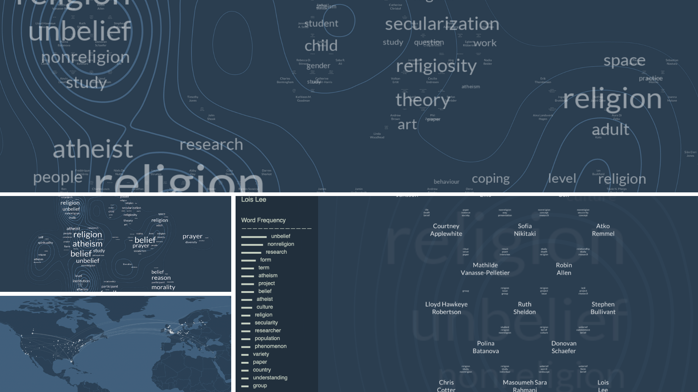

<h1 align="center"><a href="https://www.nasp.eu/people/students/students-cohorts/dominik-balaz%CC%8Cka.html">Dominik Balažka</a></h1>
 

  

  
<h6 align="justify">I’m a PhD candidate in Sociology and Methodology of Social Research at the University of Milan and the University of Turin, a joint PhD program of the Network for the Advancement of Social and Political Studies (<a href="https://www.nasp.eu/people/students/students-cohorts/dominik-balaz%CC%8Cka.html">NASP</a>). The main focus of my research activity is on religious nones, survey methods and potential impact of Big Data on the emerging field of non-religion studies. In particular, my PhD project proposes a text mining approach to the analysis of non-religious discourses in the United States and the United Kingdom between 1881 and 2019. I'm currently a member of the Society for the Scientific Study of Religion (<a href="https://sssreligion.org/">SSSR</a>) and of the International Society for Historians of Atheism, Secularism, and Humanism (<a href="https://atheismsecularismhumanism.wordpress.com/">ISHASH</a>). Before joining NASP I worked as researcher at Bruno Kessler Foundation with a double affiliation to the Center for Information and Communication Technology and to the Center for Religious Studies. Formerly, I worked on the European Values Study 2017 at Tilburg University and collaborated with the Department of Sociology and Social Research and with the Department of Information Engineering and Computer Science of the University of Trento.</h6>

   &nbsp;
   &nbsp;
   &nbsp;
   &nbsp;
   &nbsp;
   &nbsp;
   &nbsp;

 
  
<h4 align="left">Peer-reviewed articles:</h4>
<h6 align="left">• Balazka, D., Houtman, D., & Lepri, B. (2021). <a href="https://doi.org/10.1016/j.patter.2021.100263">How Can Big Data Shape the Field of Non-Religion Studies? And Why Does It Matter?</a> <i>Patterns</i> 2(6): 1-12. DOI: 10.1016/j.patter.2021.100263</h6>
<h6 align="left">• Balazka, D., & Rodighiero, D. (2020). <a href="https://doi.org/10.3389/fdata.2020.00031">Big Data and the Little Big Bang: An Epistemological (R)evolution</a>. <i>Frontiers in Big Data</i> 3, 31: 1-13.  DOI: 10.3389/fdata.2020.00031</h6>
 
  
<h4 align="left">Conferences, workshops and webinars:</h4>
<h6 align="left">• Balazka, D. (2021, October 28). <a href="https://drive.google.com/file/d/1C-ZjsNcYzC0EayFTnh2vzaNcE7x7NNGl/view?usp=sharing">Archives of Power and Power of archives</a>. <i>Data and computation cyberdiversity: Pluralismo e Intelligenza Artificiale. Nuove pratiche per l’analisi e lo studio delle tecnologie: Per un archivio dei rituali del nuovo abitare</i>, Trento, Italy.</h6>
<h6 align="left">• Balazka, D., & Rodighiero, D. (2021, June 16-18). <a href="https://www.researchgate.net/publication/350755969_Mapping_Scholarly_Affinities_in_the_Academic_Study_of_Non-Religion_and_Secularity">Mapping Scholarly Affinities in the Academic Study of Non-Religion and Secularity</a>. <i>Nonreligion and Secularity Research Network 2021</i>, Ottawa, Canada.</h6>
<h6 align="left">• Balazka, D., & Rodighiero, D. (2021, February 24). <a href="https://www.researchgate.net/publication/344175954_Was_Blumer_Right_Religious_Values_and_Quantified_Self_in_the_Petabyte_Age">Was Blumer Right? Religious Values and Quantified Self in the Petabyte Age</a>. <i>Artificial Intelligence and Religion 2020/21</i>, Trento, Italy.</h6>
 
  
<h4 align="left">Software and data repositories:</h4>
<h6 align="left">• Balazka, D., & Rodighiero, D. (2021). <a href="https://doi.org/10.5281/zenodo.4495456"><i>Cartography of Nonreligion and Secularity Research Network</i></a>. Zenodo. DOI: 10.5281/zenodo.4495456</h6>

   

 
  
<h4 align="left">Reports and popular press:</h4>
<h6 align="left">• Balazka, D. (2021, September 27). <a href="https://magazine.fbk.eu/en/news/mapping-affinities-towards-an-ethical-approach-to-network-visualization/">Mapping Affinities: Towards an Ethical Approach to Network Visualization</a>. <i>FBK Magazine</i>.</h6>
<h6 align="left">• Balazka, D. (2020, September 21). <a href="https://magazine.fbk.eu/en/news/big-data-big-faith-about-beliefs-and-biases-in-algorithmic-decision-making/">Big Data, Big Faith? About Beliefs and Biases in Algorithmic Decision-Making</a>. <i>FBK Magazine</i>.</h6>
<h6 align="left">• Balazka, D. (2020, September 1). <a href="https://magazine.fbk.eu/it/news/la-non-religione-nel-mondo/">La non-religione nel mondo</a>. <i>FBK Magazine</i>.</h6>
<h6 align="left">• Balazka, D. (2020). <a href="https://www.researchgate.net/publication/344176211_Mapping_Religious_Nones_in_112_Countries_An_Overview_of_European_Values_Study_and_World_Values_Survey_Data_1981-2020"><i>Mapping Religious Nones in 112 Countries: An Overview of European Values Study and World Values Survey Data (1981-2020)</i></a>. Technical report, Prot. 8 / 07-2020, Fondazione Bruno Kessler.</h6>


 

<h4 align="left">Invited talks:</h4>
<h6 align="left">• Balazka, D. (2021, November 11). <a href="https://drive.google.com/file/d/10r_bGRASFh8VEcJmVLiMFb7quRdeIad9/view?usp=sharing">Verso una sociologia della (non-)religione? Sfide e opportunità</a>. Religione e Comunicazione (Strategie e Tecniche della Comunicazione), Università degli Studi di Siena.</h6>
<h6 align="left">• Balazka, D. (2021, October 19). <a href="https://drive.google.com/file/d/1-jFOowWlEdqZ88VE1AYNHgDmPvGYTySO/view?usp=sharing">An Introduction to "Nones" in Sociology of Religion</a>. Global Law, Politics and Religion (Public and Cultural Diplomacy), Università degli Studi di Siena.</h6>
